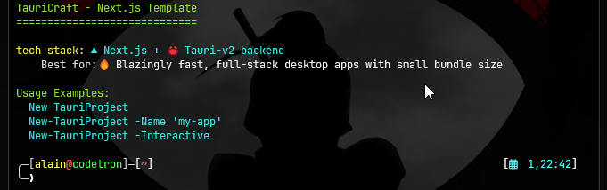


# 

[](https://www.powershellgallery.com/packages/TauriCraft) [](https://www.powershellgallery.com/packages/TauriCraft) [](LICENSE)


## 🚀 Install

```powershell
Install-Module TauriCraft -Scope CurrentUser
```
ready to go in one command.

- 🎯 **Next.js Template**: Modern React framework with TypeScript & Tailwind CSS
- 🚀 **Tauri v2**: Lightweight Rust-powered desktop app framework
- 🌍 **GitHub Actions**: Cross-platform CI/CD (Windows, macOS, Linux)

📖 usage w/ custom params:

```powershell
New-TauriProject -Name "my-app" -PackageManager "pnpm" -TargetOS @("windows-latest")
```

## 📚 Documentation

For detailed documentation and advanced usage, see [docs/Readme.md](docs/Readme.md).

## 🤝 Contributing

Contributions are welcome!